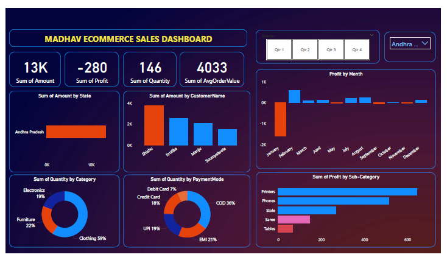
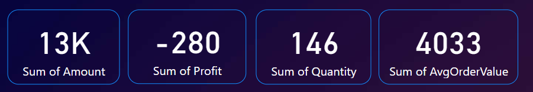
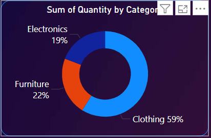

# Ecommerce_Sales_Dashboard (Power BI)

## 📌 Project Overview
This project is an interactive Power BI dashboard developed to analyze ecommerce sales performance and generate meaningful business insights.

The dashboard provides analysis on:
- Sales & Profit performance
- Category contribution
- Payment mode distribution
- Monthly profit trends
- State-wise sales
- Customer-level revenue

---

## 📈 Key Performance Indicators (KPIs)

- 💰 Total Sales Amount: 13K
- 📦 Total Quantity Sold: 146
- 📉 Total Profit: -280
- 🛒 Average Order Value: 4033

---

## 📊 Dashboard Preview

### 🔹 Full Dashboard View

### 🔹 KPI Section

### 🔹 Category Analysis

---

## 📊 Key Analysis Performed

### 1️⃣ Monthly Profit Analysis
- Visualized profit trends across months
- Identified months with negative profit

### 2️⃣ Category-wise Quantity Distribution
- Clothing – 59%
- Furniture – 22%
- Electronics – 19%

Clothing contributes the highest share of total quantity sold.

### 3️⃣ Payment Mode Analysis
- COD – 36%
- EMI – 21%
- UPI – 19%
- Debit Card – 18%
- Credit Card – 7%

COD is the most preferred payment method.

### 4️⃣ Sub-Category Profit Analysis
- Printers and Phones generate higher profit.
- Saree and Tables contribute comparatively less.

### 5️⃣ State-wise Revenue Analysis
- Andhra Pradesh contributes highest revenue.

---

## 🧹 Data Preparation

- Imported Orders.csv and Details.csv
- Cleaned and validated data types
- Created relationships between tables
- Built calculated measures using DAX

---

## 🛠 Tools & Technologies Used

- Power BI Desktop
- DAX (Data Analysis Expressions)
- Data Modeling
- Data Cleaning & Transformation

---

## 📂 Files in Repository

- Madhav Ecommerce Dashboard.pbix
- Orders.csv
- Details.csv
- Dashboard screenshots
- Project PDF

---

## 💡 Business Insights

- Clothing category drives majority sales volume.
- Certain months show negative profit, indicating cost issues.
- COD is dominant payment mode.
- Revenue is concentrated in specific regions.

---

## 👩‍💻 Author
Kavita Pat Pingua
